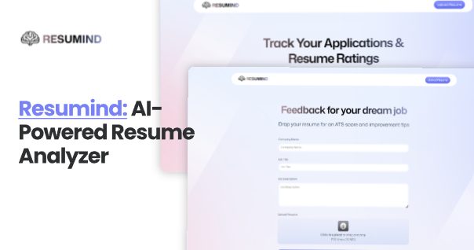

<p align="center">
  
</p>

##

<p align="center">
  
  
  
  
  
</p>

<h1 align="center">📝 Resumind: AI-Powered Resume Analyzer</h1>

<p align="center">
  <b>Resumind</b> is an AI-powered resume analyzer app that allows users to create job listings, upload resumes, and match them to job requirements. It leverages <b>React</b>, <b>Tailwind CSS</b>, <b>React Router</b>, and <b>Puter.js</b> to provide a fast and user-friendly experience.
</p>

---

## ✨ Features

- 📄 Upload and analyze resumes
- 🏢 Create and manage job listings
- 🤖 AI-powered matching between resumes and job requirements
- 🎨 Clean and responsive UI with **Tailwind CSS**
- ⚡ Fast and smooth experience with **React Router**

---

## 🌐 Demo

🔗 **Live Demo**: [Resumind](https://resumind-app.vercel.app)

---

## ⚡ Quick Start

Follow these steps to get a local copy of the project up and running.

### 1️⃣ Clone the repository

```bash
git clone https://github.com/Renz-Eryll/Resumind.git
```

### 2️⃣ Install dependencies

```bash
npm install
```

### 3️⃣ Start the development server

```bash
npm run dev
```

Open **http://localhost:5173** in your browser to view the portfolio 🚀

---

## 📧 Contact

- **Name**: Renz Eryll Ramelo
- **LinkedIn**: [www.linkedin.com/in/renz-eryll-ramelo](https://www.linkedin.com/in/renz-eryll-ramelo)
- **GitHub**: [https://github.com/Renz-Eryll](https://github.com/Renz-Eryll)
